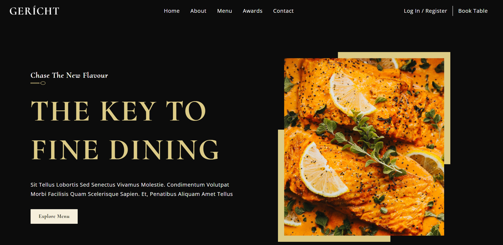
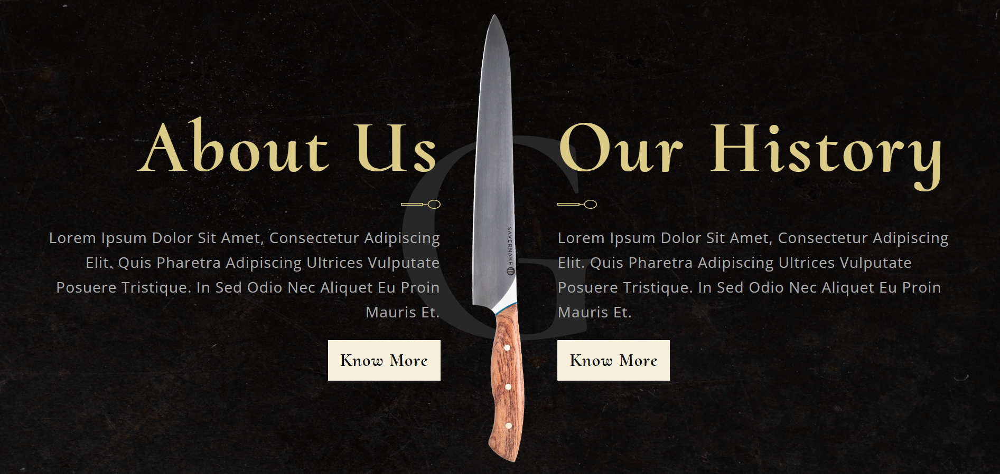
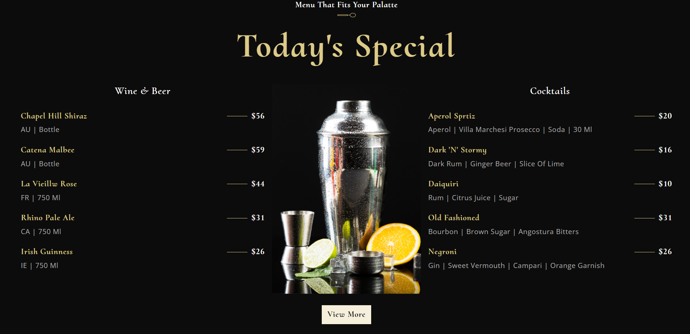
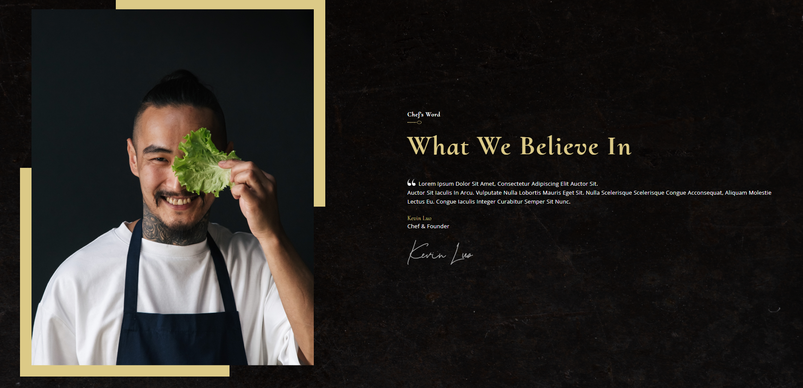
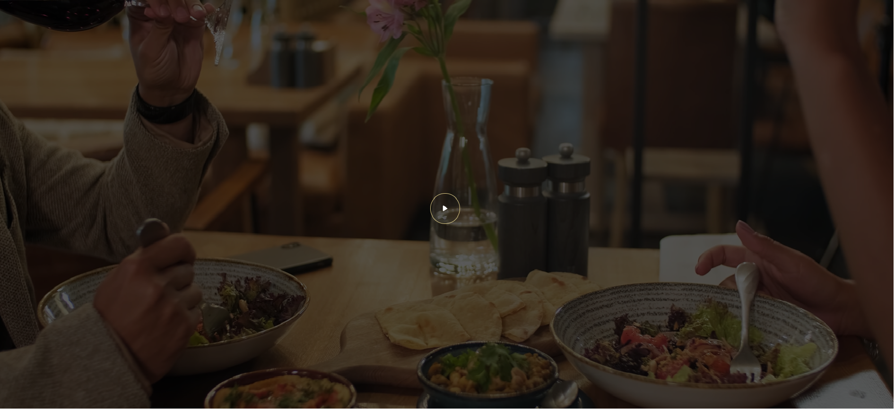
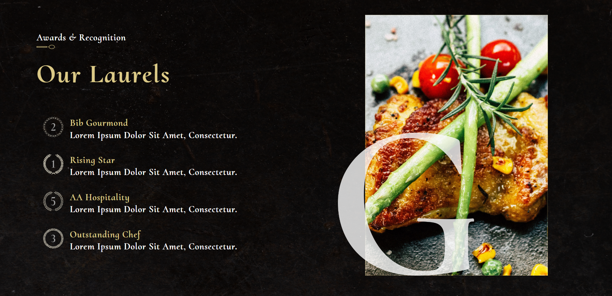
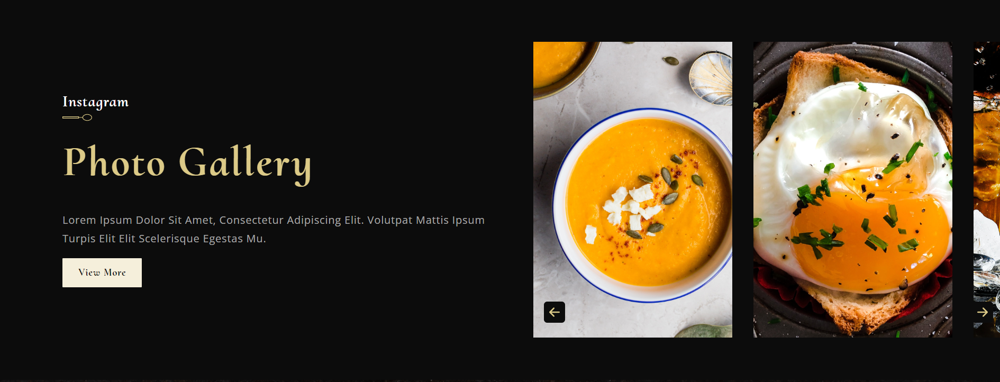
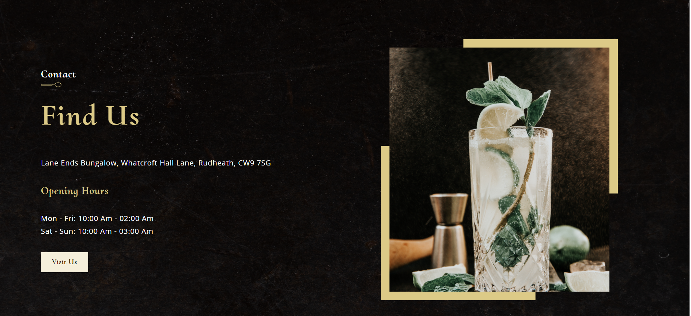
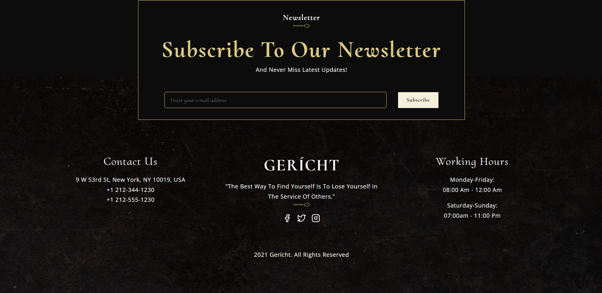

<h1 align="center"> UI GPT-3</h1>

## 💻 Projeto
Projeto desenvolvido com foco em aprimorar e conhecer novas funcionalidades do React e CSS.

Para acessar o projeto [Clique Aqui!](https://restaurant-ui-react.netlify.app/)

    
    
    
    
    
    
    
    
    

## 🚀 Tecnologias
Esse projeto foi desenvolvido com as seguintes tecnologias: 
HTML  
CSS - BEM - Blocks, Elements and Modifiers  
JavaScript 
ReactJs 

 ## 🚀 Créditos/Referência
 JS Mastery  
 https://www.youtube.com/@javascriptmastery 
 https://github.com/adrianhajdin 

                                              
